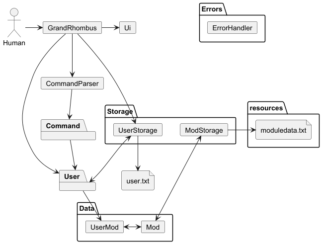
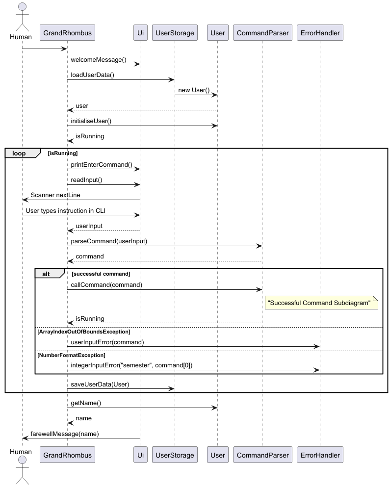
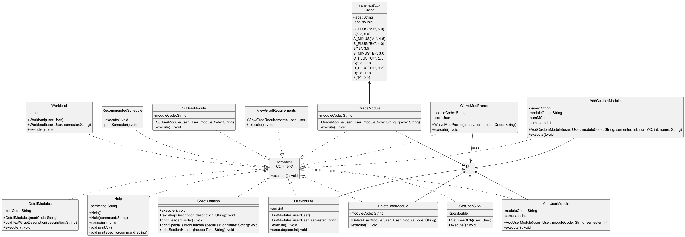

<h1 style="color:#5DADE2; text-decoration:underline;">
  <a href="https://github.com/AY2425S2-CS2113-T11b-2/tp" style="color:#5DADE2; text-decoration:underline;">
    Grand Rhombus Developer Guide
  </a>
</h1>

---

Grand Rhombus aims to provide <span style="color:blue;">CEG Students</span> with an <span style="color:green;">Academic Life Planner</span> which is <span style="color:red;">_in-depth_</span> and <span style="color:red;">_clear_</span> to plan their future.

This planner <span style="color:red;">reduces confusion</span> from having to cross-reference multiple sources so that students <span style="color:red;">do not miss academic opportunities</span>.

---

- **Acknowledgements**
- **Setting up, getting started**
- **Design**
  - Architecture
  - UI component
  - Logic component
  - Model component
  - Storage component
  - Common classes
- **Implementation**
  - [Proposed] Undo/redo feature
    - Proposed Implementation
    - Design considerations:
  - [Proposed] Data archiving
- **Documentation, logging, testing, configuration, dev-ops**
- **Appendix: Requirements**
  - Product scope
  - User stories
  - Use cases
  - Non-Functional Requirements
  - Glossary
- **Appendix: Instructions for manual testing**
  - Launch and shutdown
  - Deleting a person
  - Saving data

---

<h2>
<span style="color:orange;">Acknowledgements</span>
</h2>

- This project was inspired by the popular NUSMods website, aiding NUS students with their course and study plannings.

This project would not have been possible without the contributions and resources provided by various individuals and organizations. We would like to express our sincere gratitude to:

- **NUSMods Developers & Contributors**
    - For maintaining the NUSMods API and open-source data, which this module planner relies on for retrieving module information.

- **National University of Singapore (NUS)**
    - For providing the curriculum structure and academic resources that guided the development of this planner.

- **Open-Source Libraries & Frameworks**
    - This project referenced and used the following:
        - [JUnit](https://junit.org/) for testing
        - [Duke project](https://github.com/nus-cs2103-AY2324S1/ip), which provided a foundational understanding of Java-based CLI applications and software engineering principles.
        - [Gradle](https://gradle.org/) for build automation and dependency management

- **Professors, Mentors, and Peers**
    - Special thanks to Professor Akshay, TA Aditi & TA Donovan, and our peers for their valuable guidance, feedback, and support throughout this project.

- **Online Resources & Developer Communities**
    - We also appreciate the vast knowledge shared by developers on platforms like Stack Overflow, GitHub, and various Java documentation sources that helped us troubleshoot and enhance our implementation.


---

<h2>
<span style="color:orange;">Setting up & Getting Started</span>
</h2>

<div style="background-color: #fff3cd; border-left: 6px solid #ffa502; padding: 10px;">
<strong>⚠️  Caution: Follow the steps in the following guide precisely. </strong>
The code may not work as intended if steps are deviated from
</div>

<br/>

First, **fork** this repo, and **clone** the fork into your computer.

##### If you plan to use Intellij IDEA (highly recommended):

**Configure the JDK:** Follow the guide [se-edu/guides] IDEA: Configuring the JDK to ensure Intellij is configured to use JDK 17.

**Import the project as a Gradle project:** For instructions on importing a Gradle project into IntelliJ IDEA, refer to the [se-edu guide](https://se-education.org/guides/tutorials/intellijImportGradleProject.html).


<div style="background-color: #89CFF0; border-left: 6px solid #ffa502; padding: 10px;">
<strong> Note: </strong> Importing a Gradle project is slightly different from importing a normal Java project.
</div>
<br/>

**Verify the setup:**
- Run the seedu.address.Main and try a few commands.
- Run the tests to ensure they all pass.
- Refer to the **Manual Testing** section for more in-depth instructions on testing


---

<h2>
<span style="color:orange;">Design</span>
</h2>

<h4>
<span style="color:orange;">Architechture</span>
</h4>




The **_Architecture Diagram_** given above explains the high-level design of
the App.

Given below is a quick overview of main components and how they interact with
each other.

**Main components of the architecture**

**`GrandRhombus`** is in charge of the app launch and shut down.

- At app launch, it initializes the other components in the correct sequence, and connects them up with each other.
- At shut down, it shuts down the other components and invokes cleanup methods where necessary.

The bulk of the app’s work is done by the following three components:

- **`CommandParser`**: Parses user input and chooses the command
- **`Command`**: The individual commands which are then executed. 
- **`Data`**: A collection of classes including `User`, `UserData` which loads and saves user's modules (`Mod`) into **`user.txt`** file

*`Resources`* contains the `moduledata.txt` file which serves as the database of all CEG modules. 
These modules are converted into `Mod`s to be stored in other components.

**How the architecture components interact with each other**

The _Sequence Diagram_ below shows how the components interact with each other from startup to termination.

Note: Command.execute() may use User depending on which command it is e.g. `/add` adds a module to the User's semesterModules list

The program runs continuously till the user inputs `/exit`, which causes `CommandParser` to return **false** to isRunning.

The sections below give more details of each component.

---

<h4>
<span style="color:orange; text-decoration:underline;">CommandParser component</span>
</h4>

The `CommandParser` component consists of the `CommandParser` class. 

The `CommandParser` component,

- processes user input and chooses corresponding command.
- creates new command parses arguments into the command.
- executes user commands using the `Command` component.
- returns `isRunning` which is true for all user inputs except `/exit`

---

<h4>
<span style="color:orange; text-decoration:underline;">Command component</span>
</h4>

Here’s a (partial) class diagram of the `Command` component:


To add: Sequence Diagram for /add command 

How the `Command` component works:

1. The parameters of `Command` are passed into the chosen command object and the object is created
2. `Command` is then executed to perform its corresponding function

---

<h4>
<span style="color:orange; text-decoration:underline;">Data component</span>
</h4>

The `Data` component,

- Loads user data and module data when program starts.
- Saves user data when program is terminated.
- ModData deals with module data from the database. UserData deals with storage of User
data such as user details and modules. 
- depends on some classes in the `Model` component (because the `Storage` component’s job is to save/retrieve objects that belong to the `Model`)

Section about USER class

<h4>
<span style="color:orange; text-decoration:underline;">Common Classes</span>
</h4>
Classes used by multiple components are in the `seedu.address.commons`
package.

---

<h2>
<span style="color:orange;">Implementation</span>
</h2>

This section describes some noteworthy details on how certain features are
implemented.

<h4>
<span style="color:orange; text-decoration:underline;">Add/Delete Module feature</span>
</h4>

<h4>
<span style="color:orange;">Add Custom Module</span>
</h4>

The add custom module feature is implemented in the `AddCustomModule1` class that implements the
`Command` class. This feature allows the user to add modules that are not within the existing
database into their schedule. 

The `execute()` method of this class creates a new `UserMod` object that contains the module code, 
module name and number of MCs inputted by the user. It then adds the new module into a semester specified by the user. 

<h4>
<span style="color:orange; text-decoration:underline;">Module Data feature</span>
</h4>

<h4>
<span style="color:orange;">Check for prerequisites</span>
</h4>

This check for prerequisite mechanism is implemented by `Prereq`. It contains a `fulfillsPrereq()` function
that returns true if all the modules in the user's schedule have had their prerequisite modules cleared.
This class includes the following subclasses: 

- `ModPrereq` -- Contains a constructor to instantiate a `Prereq` object containing the module code 
and the minimum grade required.
- `AndPrereq` -- Contains functions to check for 'AND' prerequisites (i.e. prerequisites that must all be
completed before taking a module).
- `OrPrereq` -- Contains functions to check for 'OR' prerequisites (i.e. prerequisites where only one needs
to be completed before taking module).

`AndPrereq` and `OrPrereq` overrides the `fulfillsPrereq()` function.


The proposed undo/redo mechanism is facilitated by `VersionedAddressBook`. It
extends `AddressBook` with an undo/redo history, stored internally as an
`addressBookStateList` and `currentStatePointer`. Additionally, it implements
the following operations:

- `VersionedAddressBook#commit()` — Saves the current address book state in its history.
- `VersionedAddressBook#undo()` — Restores the previous address book state from its history.
- `VersionedAddressBook#redo()` — Restores a previously undone address book state from its history.

These operations are exposed in the `Model` interface as
`Model#commitAddressBook()`, `Model#undoAddressBook()` and
`Model#redoAddressBook()` respectively.

Given below is an example usage scenario and how the undo/redo mechanism
behaves at each step.

Step 1. The user launches the application for the first time. The
`VersionedAddressBook` will be initialized with the initial address book
state, and the `currentStatePointer` pointing to that single address book
state.

Step 2. The user executes `delete 5` command to delete the 5th person in the
address book. The `delete` command calls `Model#commitAddressBook()`, causing
the modified state of the address book after the `delete 5` command executes
to be saved in the `addressBookStateList`, and the `currentStatePointer` is
shifted to the newly inserted address book state.

Step 3. The user executes `add n/David …​` to add a new person. The `add`
command also calls `Model#commitAddressBook()`, causing another modified
address book state to be saved into the `addressBookStateList`.

**Note:** If a command fails its execution, it will not call
`Model#commitAddressBook()`, so the address book state will not be saved into
the `addressBookStateList`.

Step 4. The user now decides that adding the person was a mistake, and decides
to undo that action by executing the `undo` command. The `undo` command will
call `Model#undoAddressBook()`, which will shift the `currentStatePointer`
once to the left, pointing it to the previous address book state, and restores
the address book to that state.

**Note:** If the `currentStatePointer` is at index 0, pointing to the initial
AddressBook state, then there are no previous AddressBook states to restore.
The `undo` command uses `Model#canUndoAddressBook()` to check if this is the
case. If so, it will return an error to the user rather than attempting to
perform the undo.

The following sequence diagram shows how an undo operation goes through the
`Logic` component:

**Note:** The lifeline for `UndoCommand` should end at the destroy marker (X)
but due to a limitation of PlantUML, the lifeline reaches the end of diagram.

Similarly, how an undo operation goes through the `Model` component is shown
below:

The `redo` command does the opposite — it calls `Model#redoAddressBook()`,
which shifts the `currentStatePointer` once to the right, pointing to the
previously undone state, and restores the address book to that state.

**Note:** If the `currentStatePointer` is at index
`addressBookStateList.size() - 1`, pointing to the latest address book state,
then there are no undone AddressBook states to restore. The `redo` command
uses `Model#canRedoAddressBook()` to check if this is the case. If so, it will
return an error to the user rather than attempting to perform the redo.

Step 5. The user then decides to execute the command `list`. Commands that do
not modify the address book, such as `list`, will usually not call
`Model#commitAddressBook()`, `Model#undoAddressBook()` or
`Model#redoAddressBook()`. Thus, the `addressBookStateList` remains unchanged.

Step 6. The user executes `clear`, which calls `Model#commitAddressBook()`.
Since the `currentStatePointer` is not pointing at the end of the
`addressBookStateList`, all address book states after the
`currentStatePointer` will be purged. Reason: It no longer makes sense to redo
the `add n/David …​` command. This is the behavior that most modern desktop
applications follow.

The following activity diagram summarizes what happens when a user executes a
new command:

<h4>
<span style="color:orange;">Design considerations:</span>
</h4>

**Aspect: How undo & redo executes:**

- **Alternative 1 (current choice):** Saves the entire address book.
  - Pros: Easy to implement.
  - Cons: May have performance issues in terms of memory usage.
- **Alternative 2:** Individual command knows how to undo/redo by itself.
  - Pros: Will use less memory (e.g. for `delete`, just save the person being deleted).
  - Cons: We must ensure that the implementation of each individual command are correct.

_{more aspects and alternatives to be added}_

---

<h4>
<span style="color:orange; text-decoration:underline;">[Proposed] Data archiving</span>
</h4>

_{Explain here how the data archiving feature will be implemented}_

---

<h2>
<span style="color:orange; text-decoration:bold;">Documentation, logging, testing, configuration, dev-ops</span>
</h2>

- [Documentation guide](/addressbook-level3/Documentation.html)
- [Testing guide](/addressbook-level3/Testing.html)
- [Logging guide](/addressbook-level3/Logging.html)
- [Configuration guide](/addressbook-level3/Configuration.html)
- [DevOps guide](/addressbook-level3/DevOps.html)

---

<h2>
<span style="color:orange; text-decoration:bold;">Appendix: Requirements</span>
</h2>

<h4>
<span style="color:orange; text-decoration:underline;">Product scope</span>
</h4>

**Target user profile** :

- NUS CEG Students
- has a need to manage their academic workload
- prefer desktop apps over other types
- can type fast
- prefers typing to mouse interactions
- is reasonably comfortable using CLI apps

**Value proposition** : We provide CEG Students with an Academic Life Planner which is in-depth and clear to plan their future. This planner reduces confusion from having to cross-reference multiple sources so that students do not miss academic opportunities.

<h4>
<span style="color:orange; text-decoration:underline;">User Stories</span>
</h4>

Priorities: High (must have) - `* * *`, Medium (nice to have) - `* *`, Low
(unlikely to have) - `*`

| Priority | As a …​                                                | I want to …​                                                                                | So that I can…​                                            |
|----------|--------------------------------------------------------|---------------------------------------------------------------------------------------------|------------------------------------------------------------|
| `* * *`  | disciplined student                                    | be able to see my GPA, as well as an estimated future GPA based on my current module grades | make informed decisions about my future workload.          |
| `* * *`  | international student, entering NUS as a CEG1 student. | be able to see the platforms that I need to register on and their deadlines                 | register on time.                                          |
| `* * *`  | student who wants to plan my academic journey          | view my graduation requirements and track my progress                                       | ensure I graduate on time.                                 |
| `* *`    | student who is considering taking a minor              | see how the minor requirements fit into my current schedule                                 | decide if I can take the minor without overloading myself. |
| `* *`    | student who is planning to go on an exchange program   | know which modules I can map to my degree requirements                                      | plan my exchange program effectively.                      |
| `*`      | student who is curious about other specializations     | explore the requirements for other specializations                                          | consider switching if needed.                              |
| `*`      | student who wants to improve my productivity           | receive tips on how to manage my time effectively                                           | balance my academic and personal life.                     |

<h4>
<span style="color:orange; text-decoration:underline;">Use cases</span>
</h4>

(For all use cases below, the **System** is `GrandRhombus` and the
**Actor** is the `user`, unless specified otherwise)

**Use case: Add a Module**

**MSS**

1. User requests to list modules
2. AddressBook shows a list of modules in their schedule
3. User requests to add a specific module in the list
4. AddressBook adds the module

Use case ends.

**Extensions**

- 2a. The list is empty.

Use case ends.

- 3a. The given index is invalid.

  - 3a1. AddressBook shows an error message.

Use case resumes at step 2.

_{More to be added}_

<h4>
<span style="color:orange; text-decoration:underline;">Non-Functional Requirements</span>
</h4>

1. Should work on any _mainstream OS_ as long as it has Java `17` or above installed.
2. Should be able to hold up to 1000 persons without a noticeable sluggishness in performance for typical usage.
3. A user with above average typing speed for regular English text (i.e. not code, not system admin commands) should be able to accomplish most of the tasks faster using commands than using the mouse.

_{More to be added}_

<h4>
<span style="color:orange; text-decoration:underline;">Glossary</span>
</h4>

- **Mainstream OS** : Windows, Linux, Unix, MacOS

---

<h2>
<span style="color:orange; text-decoration:bold;">Appendix: Instructions for manual testing</span>
</h2>

Given below are instructions to test the app manually.

**Note:** These instructions only provide a starting point for testers to work
on; testers are expected to do more _exploratory_ testing.

<h3>
<span style="color:orange; text-decoration:underline;">Launch and shutdown</span>
</h3>

#### Initial Launch
1. Download the JAR file and copy it into an empty folder.
2. Open a terminal or command prompt, navigate to the folder, and run:
   ```sh
   java -jar GrandRhombus.jar
   ```
   The GUI launches successfully with an initial state.

#### Saving Window Preferences
1. Resize the window to an optimum size.
2. Move the window to a different location.
3. Close the window.
4. Re-launch the app by double-clicking the JAR file.
   - Expected: The most recent window size and location is retained.

<h3>
<span style="color:orange; text-decoration:underline;">Command testing</span>
</h3>

#### Exiting the Application
- Type `/exit` in the command line and press Enter.
    - The application shuts down successfully.

#### Viewing Modules
- Test case: `/view`
    - Displays the list of modules.

#### Viewing Module Details
- Test case: `/detail CS2113`
    - Displays details of the module CS2113.

#### Adding a Module
- Test case: `/add CS2113 4`
    - Adds module CS2113 successfully to semester 4.
- Test case: `/add`
    - "Error: Please specify a module code to add. Usage: /add MODULE_CODE SEMESTER"

#### Deleting a Module
- Test case: `/delete CS2113`
    - Deletes module CS2113 successfully.
- Test case: `/delete`
    - "Error: Please specify a module code to delete."

#### Invalid Commands
- Test case: `/randomcommand`
    - "Unknown command. Type '/help' for a list of commands."

#### Checking Workload
- Test case: `/workload`
    - Displays the workload if modules are present.
    - Edge Case: If no modules are present, displays "No modules in List".

#### Checking Graduation Status
- Test case: `/grad`
    - Displays graduation progress.

<h3>
<span style="color:orange; text-decoration:underline;">Data persistence testing</span>
</h3>

#### Handling Empty Module List
- Test case: Ensure no modules are added, then execute `/view`.
    - Displays empty semester lists.

#### Saving data

These tests help verify the core functionality of the command parser and the application's robustness
against invalid inputs.

